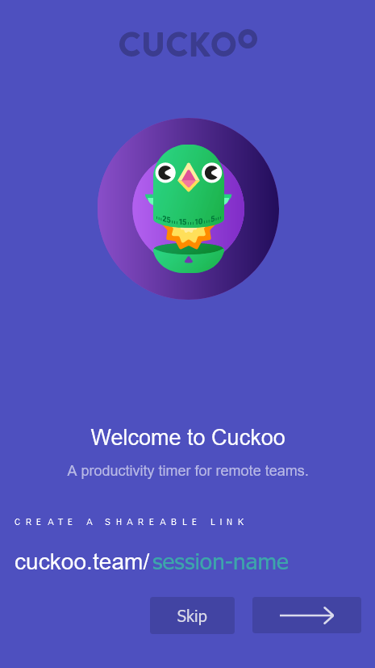
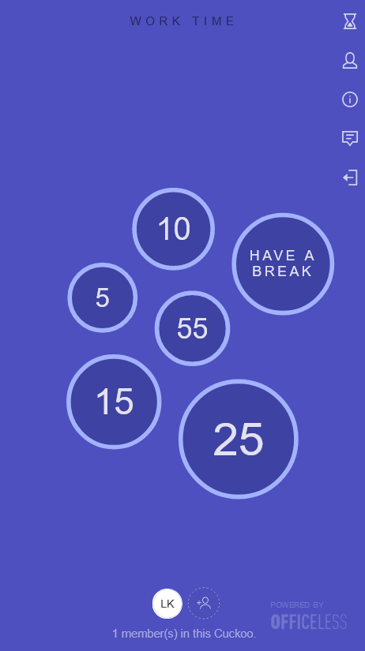
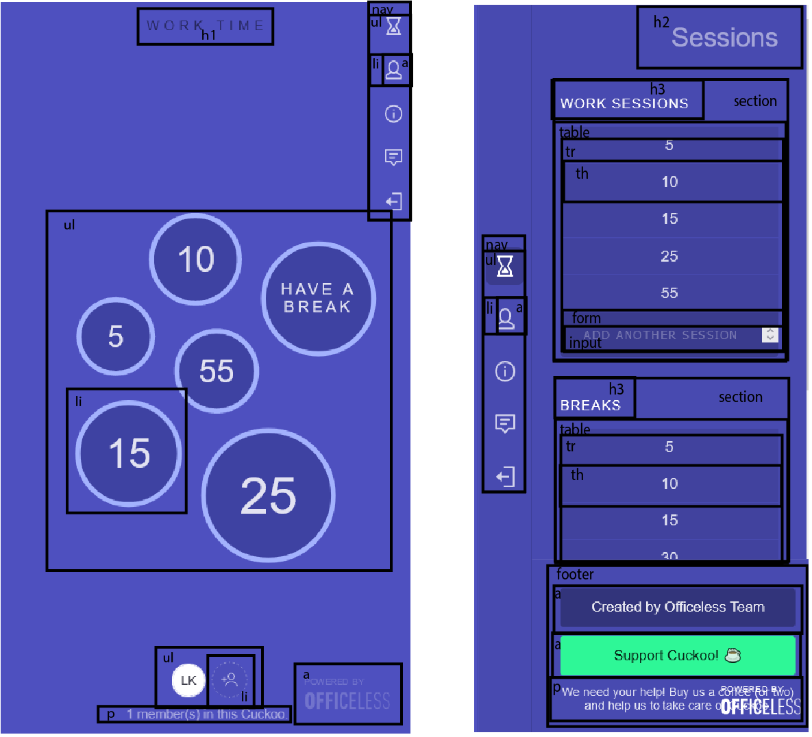
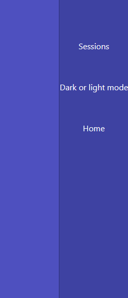
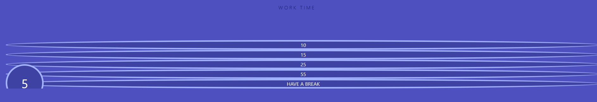

# Procesverslag
Markdown is een simpele manier om HTML te schrijven.  
Markdown cheat cheet: [Hulp bij het schrijven van Markdown](https://github.com/adam-p/markdown-here/wiki/Markdown-Cheatsheet).

Nb. De standaardstructuur en de spartaanse opmaak van de README.md zijn helemaal prima. Het gaat om de inhoud van je procesverslag. Besteedt de tijd voor pracht en praal aan je website.

Nb. Door *open* toe te voegen aan een *details* element kun je deze standaard open zetten. Fijn om dat steeds voor de relevante stuk(ken) te doen.

## Jij

uitwerken voor kick-off werkgroep

### Auteur:
Leo Kramer

#### Je startniveau:
Rood

#### Je focus:
Surface plane
 

## Je website

uitwerken voor kick-off werkgroep

### Je opdracht:
https://cuckoo.team/

#### Screenshot(s) van de eerste pagina (small screen): 
Home pagina (waar je een sessie aanmaakt).
 

#### Screenshot(s) van de tweede pagina (small screen):
Werk pagina (waar je met de pomodoro methode aan de slag gaat).
 

 

## Breakdownschets (week 1)

uitwerken na afloop 2e werkgroep

### de hele pagina: 
Deze pagina is het hart van cuckoo en bevat ook de meest interressante code. De timers lijken mij een uitdaging om te gaan coderen terwijl de website zelf eigenlijk best wel simpel is. Ik hoop dat nadat het me gelukt is om de timers natuurlijk te laten lopen dat nog wat extra functionaliteiten bij de surface plane kan toevoegen (ook ga ik kijken om de website responsive te maken, maar dat valt nog wel te doen met deze website). Tot nu toe denk ik eraan om een dark en light mode toe te voegen.

## Voortgang 1 (week 2)

uitwerken voor 1e voortgang

### Stand van zaken
Tot nu toe is het niet heel lastig geweest om de website in elkaar te gooien, de html is niet heel ingewikkeld en de grootste onderdelen van de website zijn makkelijk in CSS te regelen (zoals de achtergrond kleur en het plaatsen van alle tekst). Waar ik wel moeite mee had was de navigatiebalk. Na wat spelen is het me gelukt om die op de juiste positie te zetten, maar ik had ook problemen met de hover (een compleet andere sectie bedekte de ruimte waar je op zou moeten hoveren), dit is nu wel opgelost. De grootste uitdaging zijn de timers, die moeten nog flink uitgewerkt worden, maar de fundering is bijna klaar dus de timers statisch neerzetten moet nu makkelijk te doen zijn voor volgende week.
 

### Agenda voor meeting
samen met je groepje opstellen

| Leo      | Timo          | Joppe    | Maeren        |
| ---            | ---                | ---          | ---              |
| Willekeurige posities  | Responsiveness              | HTML structuur    | Hoe ik een nette html kan schrijven zonder div’s    |
| Meer beweging bij elementen (schudden of colisions en zo) | positioneren | Positioneren | id’s en classes |
| Informatie opslaan en verwerken |  |  | CSS positioneren |

### Verslag van meeting
hier na afloop snel de uitkomsten van de meeting vastleggen

- punt 1
- punt 2
- nog een punt
- ...

## Voortgang 2 (week 3)

uitwerken voor 2e voortgang

### Stand van zaken
hier dit ging goed & dit was lastig (neem ook screenshots op van delen van je website en code)

### Agenda voor meeting
samen met je groepje opstellen

| student 1      | student 2          | student 3    | student 4        |
| ---            | ---                | ---          | ---              |
| dit bespreken  | en dit             | en ik dit    | en dan ik dat    |
| en dat ook nog | dit als er tijd is | nog een punt | dit wil ik zeker |
| ...            | ...                | ...          | ...              |

### Verslag van meeting
hier na afloop snel de uitkomsten van de meeting vastleggen

- punt 1
- punt 2
- nog een punt
- ...

## Toegankelijkheidstest (week 4)

uitwerken na test in 8e voortgang

### Bevindingen
Lijst met je bevindingen die in de test naar voren kwamen:

#### Titel eerste bevinding
Hier korte omschrijving (met indien nodig een afbeelding)

Hier een omschrijving van hoe het opgelost kan worden (met indien nodig een afbeelding)

#### Titel tweede bevinding. 
Hier korte omschrijving (met indien nodig een afbeelding)

Hier een omschrijving van hoe het opgelost kan worden (met indien nodig een afbeelding)

#### Titel volgende bevinding. 
Hier korte omschrijving (met indien nodig een afbeelding)

Hier een omschrijving van hoe het opgelost kan worden (met indien nodig een afbeelding)

#### Titel nog een bevinding. 
Hier korte omschrijving (met indien nodig een afbeelding)

Hier een omschrijving van hoe het opgelost kan worden (met indien nodig een afbeelding)

## Voortgang 3 (week 4)

uitwerken voor 3e voortgang

### Stand van zaken
hier dit ging goed & dit was lastig (neem ook screenshots op van delen van je website en code)

### Agenda voor meeting
samen met je groepje opstellen

| student 1      | student 2          | student 3    | student 4        |
| ---            | ---                | ---          | ---              |
| dit bespreken  | en dit             | en ik dit    | en dan ik dat    |
| en dat ook nog | dit als er tijd is | nog een punt | dit wil ik zeker |
| ...            | ...                | ...          | ...              |

### Verslag van meeting
hier na afloop snel de uitkomsten van de meeting vastleggen

- punt 1
- punt 2
- nog een punt
- ...

## Eindgesprek (week 5)

uitwerken voor eindgesprek

### Stand van zaken
hier dit ging goed & dit was lastig (neem ook screenshots op van delen van je website en code)

### Screenshot(s)

hier screenshot(s) van je eindresultaat

## Bronnenlijst

continu bijhouden terwijl je werkt

Nb. Wees specifiek ('css-tricks' als bron is bijv. niet specifiek genoeg).

1. bron 1
2. bron 2
3. ...

