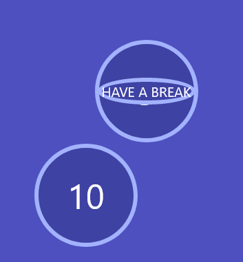
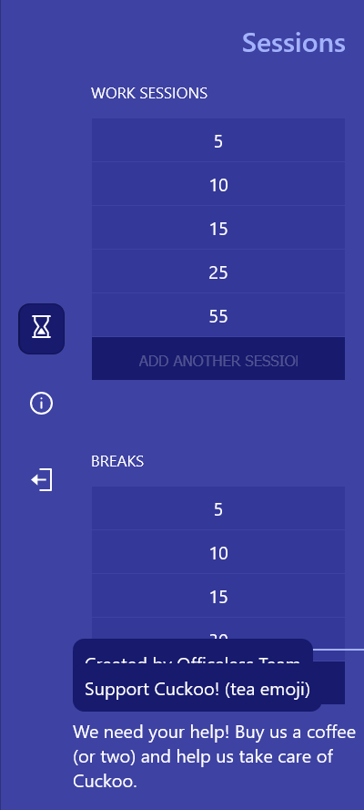
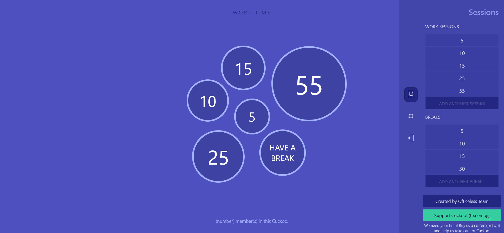

# Procesverslag
Markdown is een simpele manier om HTML te schrijven.  
Markdown cheat cheet: [Hulp bij het schrijven van Markdown](https://github.com/adam-p/markdown-here/wiki/Markdown-Cheatsheet).

Nb. De standaardstructuur en de spartaanse opmaak van de README.md zijn helemaal prima. Het gaat om de inhoud van je procesverslag. Besteedt de tijd voor pracht en praal aan je website.

Nb. Door *open* toe te voegen aan een *details* element kun je deze standaard open zetten. Fijn om dat steeds voor de relevante stuk(ken) te doen.

## Jij

uitwerken voor kick-off werkgroep

### Auteur:
Leo Kramer

#### Je startniveau:
Rood

#### Je focus:
Surface plane
 

## Je website

uitwerken voor kick-off werkgroep

### Je opdracht:
https://cuckoo.team/

#### Screenshot(s) van de eerste pagina (small screen): 
Home pagina (waar je een sessie aanmaakt).
 

#### Screenshot(s) van de tweede pagina (small screen):
Werk pagina (waar je met de pomodoro methode aan de slag gaat).
 

 

## Breakdownschets (week 1)

uitwerken na afloop 2e werkgroep

### de hele pagina: 
Deze pagina is het hart van cuckoo en bevat ook de meest interressante code. De timers lijken mij een uitdaging om te gaan coderen terwijl de website zelf eigenlijk best wel simpel is. Ik hoop dat nadat het me gelukt is om de timers natuurlijk te laten lopen dat nog wat extra functionaliteiten bij de surface plane kan toevoegen (ook ga ik kijken om de website responsive te maken, maar dat valt nog wel te doen met deze website). Tot nu toe denk ik eraan om een dark en light mode toe te voegen.

## Voortgang 1 (week 2)

uitwerken voor 1e voortgang

### Stand van zaken
Tot nu toe is het niet heel lastig geweest om de website in elkaar te gooien, de html is niet heel ingewikkeld en de grootste onderdelen van de website zijn makkelijk in CSS te regelen (zoals de achtergrond kleur en het plaatsen van alle tekst). Waar ik wel moeite mee had was de navigatiebalk. Na wat spelen is het me gelukt om die op de juiste positie te zetten, maar ik had ook problemen met de hover (een compleet andere sectie bedekte de ruimte waar je op zou moeten hoveren), dit is nu wel opgelost. De grootste uitdaging zijn de timers, die moeten nog flink uitgewerkt worden, maar de fundering is bijna klaar dus de timers statisch neerzetten moet nu makkelijk te doen zijn voor volgende week.
 

### Agenda voor meeting
samen met je groepje opstellen

| Leo      | Timo          | Joppe    | Maeren        |
| ---            | ---                | ---          | ---              |
| Willekeurige posities  | Responsiveness              | HTML structuur    | Hoe ik een nette html kan schrijven zonder div’s    |
| Meer beweging bij elementen (schudden of colisions en zo) | positioneren | Positioneren | id’s en classes |
| Informatie opslaan en verwerken |  |  | CSS positioneren |

### Verslag van meeting
hier na afloop snel de uitkomsten van de meeting vastleggen

- Random positioneren: https://developer.mozilla.org/en-US/docs/Web/JavaScript/Reference/Global_Objects/Math/random
- Media queries: https://developer.mozilla.org/en-US/docs/Web/CSS/Media_Queries/Using_media_queries

## Voortgang 2 (week 3)

uitwerken voor 2e voortgang

### Stand van zaken
Ik had deze week nog heel veel moeite met het positioneren van alle timers, uiteindelijk met wat hulp van Sanne is het me gelukt om de fundering te hebben. Het enige wat er nu moet gebeuren is alle timers neerzetten op de juiste plek (en daarna de volgende pagina coderen). Ik zat daar vooral vast mee dus dat kostte mijn hele week eigenlijk. Gelukkig is dit eigenlijk het lastigste gedeelte van mijn code en is de rest wel te doen.
 

### Agenda voor meeting
samen met je groepje opstellen

| Leo      | Timo          | Joppe    | Maeren        |
| ---            | ---                | ---          | ---              |
| Hoe selectoren aanpakt wanneer je met meerdere pagina's werkt  | Werken met media query's voor responsiveness | Werken met grid/ flexbox  | Hoe ik een nette html kan schrijven zonder div’s, id’s en classes   |
| Werken met media query's voor responsiveness | |  | CSS positioneren. |

### Verslag van meeting
hier na afloop snel de uitkomsten van de meeting vastleggen

- Gebruik classes en id's als selectoren niet goed lopen over twee pagina's.

## Toegankelijkheidstest (week 4)

uitwerken na test in 8e voortgang

### Bevindingen
Lijst met je bevindingen die in de test naar voren kwamen:

#### Motoriek beperking
Hier korte omschrijving (met indien nodig een afbeelding)
Bij motorieke beperkingen is het lastig om op kleine knoppen te drukken. Je gaat veel makkelijker over de hele pagina heen waardoor je minder snel kijkt naar de details in een webpagina.

Hier een omschrijving van hoe het opgelost kan worden (met indien nodig een afbeelding)
Hou knoppen groot en probeer ook veel ondersteuning met het toetsenbord te houden zodat ze niet eens zo veel problemen zullen hebben met de muis (dit is te doen door de focus state duidelijk te houden en dat je ook alles kan selecteren met je toetsenbord dat nodig is).

#### Zicht
Hier korte omschrijving (met indien nodig een afbeelding)
Mensen met kleurenblindheid of een niet optimaal zicht kunnen niet goed contrast zien tussen twee kleuren. Ook zien ze niet de volledige pagina duidelijk.

Hier een omschrijving van hoe het opgelost kan worden (met indien nodig een afbeelding)
Zorg ervoor dat de meest belangrijke informatie gegroepeerd is (bijv. de navigatie). Ook duidelijk contrast tussen twee kleuren is belangrijk, vooral bij de achtergrond.

#### Screenreader
Hier korte omschrijving (met indien nodig een afbeelding)
Met een screenreader zegt die soms dingen dubbel neer vanwege de naamgeving van sommige elementen, ook lees je de pagina veel meer van onder naar beneden in plaats van dat je oog echt de compositie volgt.

Hier een omschrijving van hoe het opgelost kan worden (met indien nodig een afbeelding)
Hou een duidelijk structuur die van onder naar beneden loopt en vermijd zo veel mogelijk elementen een dubbele naamgeving te geven zodat het fijner te lezen valt met een screenreader.

## Voortgang 3 (week 4)

uitwerken voor 3e voortgang

### Stand van zaken
Ik heb deze week zo'n 90% van de website nagemaakt (zonder nog extra features). Ik had vooral moeite met het de sidebar werkende te laten maken aangezien er verschillende pagina's te zien zijn in een sidebar i.p.v. echt een navigatiemenu. Uiteindelijk is het wel gelukt en ik ben al heel trots op het resultaat. Nu nog puntjes op de i zetten.
 
 

### Agenda voor meeting
samen met je groepje opstellen

| Leo      | Timo          | Joppe    | Maeren        |
| ---            | ---                | ---          | ---              |
| variabelen veranderen van css via javascript  | Werken met media query's voor responsiveness | Grid in de footer  | |
| | | En vraag over @font-face | |

### Verslag van meeting
hier na afloop snel de uitkomsten van de meeting vastleggen

- ik had niet echt feedback gekregen aangezien het meeste wel zelf lukt

## Eindgesprek (week 5)

uitwerken voor eindgesprek

### Stand van zaken
De website is nu nagemaakt. Het enige waar ik geen tijd voor had is de tweede menu optie. Hierbij wou ik graag een dark mode en een contrast mode geven (ook in het algemeen wou ik meer werk doen voor responsiveness, maar dat was ook niet bepaald mijn focus). Ik zou hier nog aan de toekomst aan willen werken.

### Screenshot(s)

hier screenshot(s) van je eindresultaat
 
 
 
 

## Bronnenlijst

continu bijhouden terwijl je werkt

Nb. Wees specifiek ('css-tricks' als bron is bijv. niet specifiek genoeg).
 
1. https://css-tricks.com/snippets/css/a-guide-to-flexbox/
2. https://www.w3schools.com/
3. https://codepen.io/shooft

